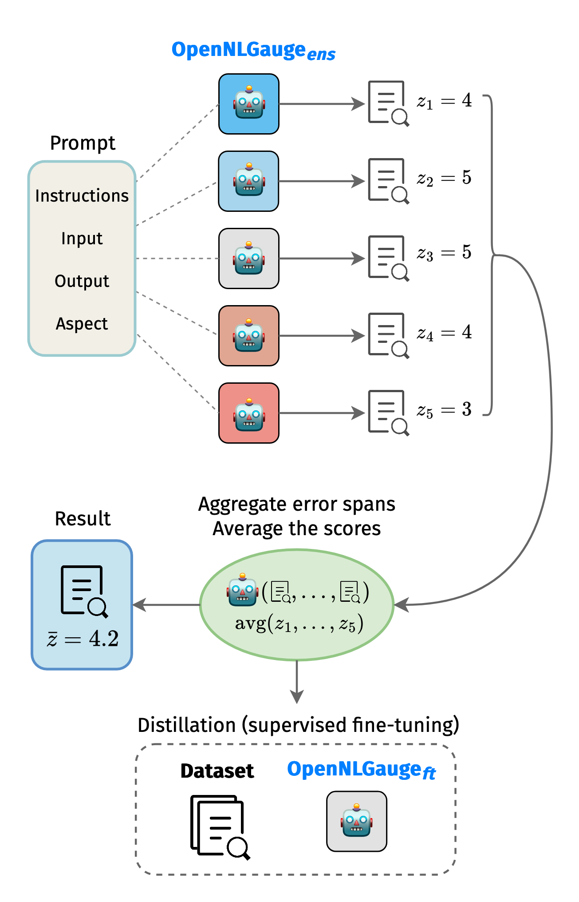

# OpeNLGauge

Code and resources for the INLG 2025 paper [OpeNLGauge: An Explainable Metric for NLG Evaluation with Open-Weights LLMs](https://aclanthology.org/2025.inlg-main.19/)

## Overview

<div align="center">
  
</div>

## Table of Contents

- [Installation](#installation)
- [Data](#data)
- [Ensemble of Prompted Open-Weight LLMs](#ensemble-of-prompted-open-weight-llms)
- [Fine-tuned Model](#fine-tuned-model)
- [Meta-evaluation](#meta-evaluation)
- [License](#license)

## Installation

Create a virtual environment (recommended Python version is 3.10) and install the dependencies:

```bash
pip install -r requirements.txt
```

## Data

### Training Data

The synthetic dataset used to train the distilled model can be found in `data/training/train_ensemble_merged.json`. Each training example consists of the following fields:

- `dataset`: name of the source dataset
- `input_id`: unique id of the input in the source dataset
- `system`: system used to generate the output
- `inputs`: mapping of one or more headers (e.g. "Article", "Dialogue history", "Question") to input values
- `outputs`: mapping of headers (e.g. "Summary", "Response", "Answer") to output values
- `aspect_name`: name of the aspect to evaluate
- `aspect_definition`: definition of the evaluation aspect
- `task_type`: category of the task
- `task_name`: name of the task (e.g. "summarization", "data-to-text")
- `extra_task_info`: extra information about the task
- `evaluation`: generated evaluation of the output, consisting of error analysis and overall score (between 0 and 100)

The file `data/training/train_ensemble_original.json` contains evaluation outputs of the individual prompted LLMs. The evaluations are postprocessed and parsed to a structured format.

### Meta-evaluation Datasets

Preprocessed datasets used for meta-evaluation of our approach can be found in `data/meta_eval`.

## Ensemble of Prompted Open-Weight LLMs

To reproduce the results with the individual prompted LLMs or the ensemble with Ollama, install the package following the instructions in the [Ollama repository](https://github.com/ollama/ollama). After Ollama is installed and running, use the `pull` command to download the models. For example, to download the Llama 3.1 Nemotron 70B model, run the following command:

```bash
ollama pull nemotron:70b-instruct-q8_0
```

Then create the model from the modelfile:

```bash
ollama create eval_nemotron -f openlgauge/configs/ollama/modelfile_nemotron
```

To run the evaluation, use `openlgauge/run_ollama.py` script. For example, to evaluate on the QAGS dataset for factual consistency with `eval_nemotron` model, use the following command:

```bash
python openlgauge/eval_zero_shot.py --model eval_nemotron --template openlgauge/templates/zero_shot/qags.jinja --data openlgauge/data/meta_eval/qags.json --aspect-config openlgauge/configs/eval_aspects/qags-factual_consistency.json --output-dir openlgauge/results/openlgauge_ollama
```

For other models, see the modelfiles in `openlgauge/configs/ollama`. Prompt templates for zero-shot evaluation on all datasets evaluated in the paper can be found in `openlgauge/templates/zero_shot`. Configurations of different evaluation aspects are in `openlgauge/configs/eval_aspects`.

## Fine-tuned Model

### Training

The distilled OpeNLGauge evaluation metric can be trained using the `train.py` script, which fine-tunes Llama 3.1 8B on our synthetic dataset. 

```bash
python openlgauge/train.py --dataset data/training/train_ensemble.json --template openlgauge/templates/finetuned/template.jinja --config openlgauge/configs/training_config.json --model-name openlgauge_ft --output-dir openlgauge/checkpoints/openlgauge_ft
```

### Inference

To run the inference with the fine-tuned model, use the `eval_finetuned.py` script. For example, to evaluate factual consistency of summaries in the QAGS dataset with the fine-tuned model, use the following command:

```bash
python openlgauge/eval_finetuned.py --model openlgauge/model --config openlgauge/configs/inference_config.json --template openlgauge/templates/zero_shot/qags.jinja --data openlgauge/data/qags.json --aspect-config openlgauge/configs/eval_aspects/qags-factual_consistency.json --output-dir openlgauge/results/openlgauge_ft --retry
```

## Meta-evaluation

Please check back soon for updates.

## License

Licensed under [Creative Commons Attribution-NonCommercial-ShareAlike 4.0 International License](https://creativecommons.org/licenses/by-nc-sa/4.0/).

## Acknowledgements

This work was supported by the European Research Council (Grant agreement No. 101039303, NG-NLG) and the National Recovery Plan funded project MPO 60273/24/21300/21000 CEDMO 2.0 NPO. It used resources of the LINDAT/CLARIAH-CZ Research Infrastructure (Czech Ministry of Education, Youth, and Sports project No. LM2018101).
